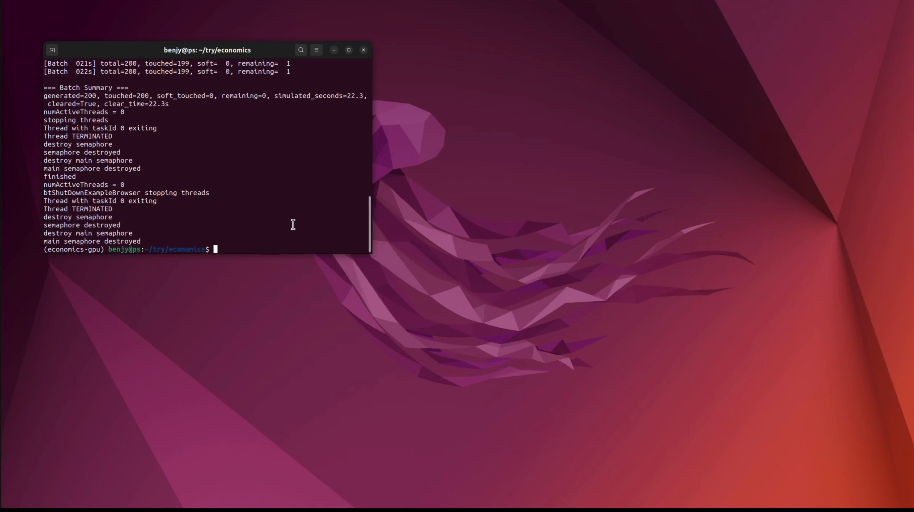

# Price-Guided Multi-Arm Coordination Demo (PyBullet)

A research-oriented demo for price-guided coordination in multi-arm manipulation.

## Live Demo

[Open the autoplay demo page](https://benjy-byj.github.io/Price-Guided-Multi-Arm-Coordination/)

## Demo Video

[](assets/demo-video.mp4)

Click the preview image above to open the recorded demo video.

## Autoplay Demo Page

This repository also includes a GitHub Pages landing page at `index.html` with a
browser-compatible autoplay setup.

After pushing the repository to GitHub:

1. Open `Settings -> Pages`
2. Set `Source` to `Deploy from a branch`
3. Select branch `main` and folder `/(root)`
4. Save

Your autoplay demo page will then be available at:

`https://benjy-byj.github.io/Price-Guided-Multi-Arm-Coordination/`

Notes:

- the page autoplays the demo muted by default
- this is intentional because browsers generally only allow autoplay for muted media
- users can unmute from the page after it opens
- GitHub Pages may take a minute or two after the first enablement; until deployment finishes, the link can return `404`

The project has two layers:

1. Abstract planning layer
   - 3D workspace discretization
   - multi-candidate paths
   - space-time congestion pricing
   - `NoPricing` vs `Pricing` comparison
2. PyBullet execution layer
   - 4 KUKA iiwa arms
   - IK-based waypoint tracking
   - online target stream and batch target modes

## Repository layout

- `main.py`: CLI entry point
- `price_coord_demo/core.py`: workspace, targets, candidate paths, robot agents, pricing coordinator
- `price_coord_demo/experiment.py`: static experiment setup, target generation, plotting
- `price_coord_demo/streaming.py`: online stream mode and batch-at-`t=0` throughput mode
- `price_coord_demo/pybullet_exec.py`: PyBullet scene setup, IK execution, debug drawing
- `price_coord_demo/array_backend.py`: `numpy` / `cupy` backend abstraction
- `assets/`: video and README media assets
- `outputs/`: example figures generated by the planning layer

## Current scenario

- 4 robot arms arranged around a shared open workspace
- no table; the scene uses a ground plane to expose more reachable poses
- time-expanded pricing grid over `(x, y, z, t)`
- lower-capacity bottleneck region in the shared center
- target points can be central, flank-side, or outer-side
- generated online or batch targets are filtered so that at least one arm can reach them

## What is implemented

- `GridWorkspace`, `TargetPoint`, `CandidatePath`, `RobotAgent`, `PricingCoordinator`
- candidate path styles:
  - `direct`
  - `via_center`
  - `up_then_translate`
  - `edge_detour`
- market-style iterative pricing:
  - `score = utility - path_cost - price_penalty`
  - `price <- clip((1 - decay) * price + alpha * (demand - capacity), 0, max_price)`
- baseline and pricing comparison plots:
  - `outputs/price_history.png`
  - `outputs/paths_3d.png`
- PyBullet playback of the selected paths
- online stream mode:
  - red targets appear over time
  - countdown/deadline-aware utility
  - touched targets disappear
- batch mode:
  - all targets appear at `t=0`
  - reports total simulated time until all targets are cleared or timeout is reached
- strict-touch mode:
  - disables soft completion
  - only counts a target as completed when the end-effector is truly within the touch threshold
- optional GPU backend for price tensors via CuPy

## Install

### CPU / standard setup

```bash
python3 -m venv .venv
source .venv/bin/activate
pip install -r requirements.txt
```

### Optional GPU setup

If you want to run the pricing tensor backend on GPU:

```bash
conda create -y -n economics-gpu -c conda-forge --override-channels python=3.11 numpy matplotlib pip
conda activate economics-gpu
pip install pybullet cupy-cuda12x
```

Notes:

- `cupy-cuda12x` is optional
- PyBullet GUI itself is still mostly CPU-bound
- GPU only accelerates the array backend used by the pricing layer

## Main run modes

### 1. Static planning only

Runs the abstract planning layer, prints iteration logs, and saves figures.

```bash
python main.py --skip-pybullet
```

### 2. Static PyBullet demo

Runs the planning layer first, then executes the selected paths in PyBullet.

```bash
python main.py --gui
```

### 3. Online streaming targets

Targets appear over time.

```bash
python main.py --gui --stream-targets --stream-points 100 --stream-duration 100
```

### 4. Batch targets at t=0

All targets are spawned immediately. This is useful for measuring throughput / clear time.

```bash
python main.py --gui --batch-targets --batch-points 100 --batch-max-duration 120
```

## Reproducibility

Use `--seed` to make the generated targets reproducible.

Examples:

```bash
python main.py --batch-targets --batch-points 100 --batch-max-duration 120 --seed 7
python main.py --gui --stream-targets --stream-points 100 --stream-duration 100 --seed 7
```

For batch and stream modes, the same seed reproduces the same target generation process.

## Useful examples

### CPU planning

```bash
python main.py --skip-pybullet --grid-size 10 --array-backend numpy
```

### GPU planning backend

```bash
python main.py --skip-pybullet --grid-size 10 --array-backend cupy
```

### Strict-touch batch throughput test

```bash
python main.py --gui --batch-targets --batch-points 200 --batch-max-duration 120 --seed 7 --strict-touch
```

### Batch throughput comparison template

Use the same seed and the same batch size so the target set is reproducible across runs.

Pricing-enabled run:

```bash
python main.py --batch-targets --batch-points 200 --batch-max-duration 120 --seed 7 --strict-touch
```

Baseline-style run with weaker congestion response:

```bash
python main.py --batch-targets --batch-points 200 --batch-max-duration 120 --seed 7 --strict-touch \
  --price-weight 0.0
```

What to compare:

- `cleared`
- `clear_time`
- `remaining`
- `soft_touched` should stay `0` in strict-touch mode

Notes:

- `--price-weight 0.0` is a practical batch-mode baseline if you want the online allocator to ignore congestion prices
- keep `--seed`, `--batch-points`, `--batch-max-duration`, `--robot-base-radius`, and `--joint-max-velocity` fixed when comparing

### Faster GUI playback

```bash
python main.py --gui --batch-targets --batch-points 200 --batch-max-duration 120 --real-time-factor 8
```

### Slower, more visibly realistic joint motion

```bash
python main.py --gui --batch-targets --batch-points 200 --batch-max-duration 120 \
  --strict-touch --joint-max-velocity 0.45
```

### Tighter robot formation

```bash
python main.py --gui --batch-targets --batch-points 200 --batch-max-duration 120 \
  --robot-base-radius 0.60 --robot-home-radius 0.16
```

## Important CLI options

### Planning / pricing

- `--grid-size`
- `--array-backend {numpy,cupy}`
- `--max-iters`
- `--min-pricing-iters`
- `--alpha`
- `--decay`
- `--price-weight`
- `--max-price`
- `--switch-threshold`
- `--time-horizon`
- `--time-bin-size`
- `--nominal-speed`

### Execution

- `--gui`
- `--joint-max-velocity`
- `--real-time-factor`
- `--hold-seconds`

### Robot layout

- `--robot-base-radius`
- `--robot-home-radius`

### Static targets

- `--num-targets`

### Stream mode

- `--stream-targets`
- `--stream-points`
- `--stream-duration`
- `--stream-replan-interval`
- `--stream-touch-threshold`
- `--stream-min-deadline`
- `--stream-max-deadline`
- `--stream-urgency-bonus`
- `--stream-overtime-rate`
- `--stream-overtime-saturation`

### Batch mode

- `--batch-targets`
- `--batch-points`
- `--batch-max-duration`

### Touch / reachability behavior

- `--strict-touch`
- `--stream-max-ik-error`
- `--stream-assignment-touch-slack`
- `--stream-progress-epsilon`
- `--stream-stall-timeout`
- `--stream-reassign-cooldown`
- `--stream-max-assignment-age`
- `--stream-soft-touch-margin`

## Interpretation notes

- `--skip-pybullet` is only for the static planning demo
- batch/stream modes require the PyBullet execution layer
- batch mode is the best option if you want to compare total clear time under a fixed workload
- strict-touch mode is more faithful, but it may leave some targets unfinished within a short time budget

## Notes on current simplifications

- Congestion is proxied by shared occupancy of discrete space-time cells, not full continuous collision checking
- IK execution is end-effector waypoint tracking only; there is no grasping or TAMP-level contact planning
- The pricing layer can run on GPU, but PyBullet GUI and most execution logic remain CPU-bound
- PyBullet GUI is largely single-threaded; seeing one CPU core saturated is normal
- Finer voxelization is not automatically better: if the grid becomes too fine, shared occupancy can become sparse and the price signal may weaken
- Target generation is filtered so that each generated target is reachable by at least one robot, not necessarily all robots

## Corner-case handling

### Under-utilization from runaway prices

The pricing update includes decay / smoothing:

`price <- clip((1 - decay) * price + alpha * (demand - capacity), 0, max_price)`

This prevents permanently overpricing a shared corridor.

### Online deadlock / unreachable assignments

The online modes include:

- assignment-time IK filtering
- no-progress timeout release
- maximum assignment age
- retry cooldown

### Strict touch vs soft completion

- default mode may use soft completion for near-threshold stalled cases
- `--strict-touch` disables that behavior entirely

## Suggested next steps

1. Decouple geometry resolution from pricing resolution
   - keep fine geometry for visualization
   - use a coarser corridor-resource grid for congestion pricing
2. Add `NoPricing` vs `Pricing` throughput comparison in batch mode
3. Add time-to-clear and per-target latency histograms
4. Add collision-aware joint-space trajectory generation
5. Add synchronized multi-arm execution instead of independent waypoint chasing

## Disclaimer

This repository contains research code for reproducing the experiments in the paper.
Parts of the implementation were generated with the assistance of AI coding tools.

The code is provided for research purposes only and may contain bugs or incomplete
implementations. Users should verify results before using it in production environments.

## License

This project is released under the MIT License. See [LICENSE](LICENSE).
